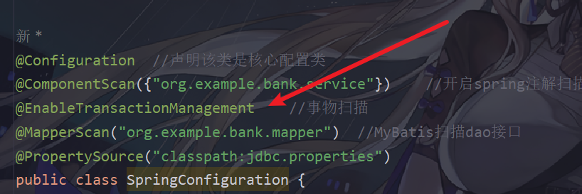
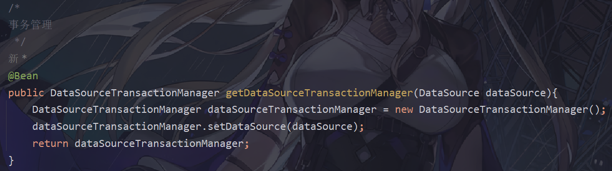
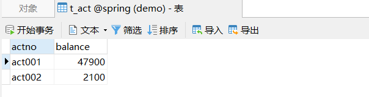
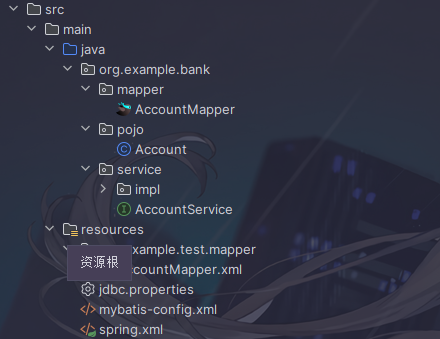
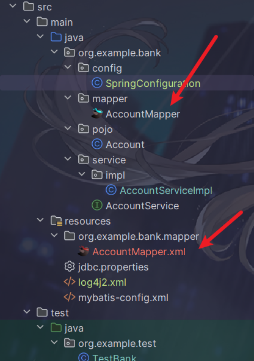

# Spring6 集成 MyBatis

  业务功能：实现从账户转钱到另一个账户的操作,添加事务管理，`Log4j2`日志框架

## 1 事务基础

事务中的重点属性： 

- 事务传播⾏为 
- 事务隔离级别 
- 事务超时 
- 只读事务 
- 设置出现哪些异常 回 滚事务 
- 设置现哪些异常不 回 滚 事 务

### 1.1 事务传播⾏为 propagation 

在service类中有a()⽅法和b()⽅法，a()⽅法上有事务，b()⽅法上也有事务，当a()⽅法执⾏过程中调⽤了 b()⽅法，事务是如何传递的？合并到⼀个事务⾥？还是开启⼀个新的事务？这就是事务传播⾏为。


| 传播属性     | 描述                                                         |
| ------------ | ------------------------------------------------------------ |
| REQUIRED     | 如果有事务在运行，当前的方法就在这个事务内运行，否则，就启动一个新的事务，并在自己的事务内运行 |
| REQUIRED_NEW | 当前的方法必须启动新事物，并在他自己的事务内运行，如果有事务正在运行，应该将他挂起 |
| SUPPORTS     | 如果有事务在运行，当前的方法就在这个事务内运行，否则他可以不运行在事务中 |
| NOT_SUPPORTS | 当前的方法不应该运行在事务中，如果有运行的事务，将他挂起     |
| MANDATORY    | 当前的方法必须运行在事务内部，如果没有正在运行的事务，就抛出异常 |
| NEVER        | 当前的方法不应该运行在事务中，如果有运行的事务，就抛出异常   |
| NESTED       | 如果有事务在运行，当前的方法就应该在这个事务的嵌套事务内运行，否则，就启动一个新的事务，并在它自己的事务内运行 |

### 1.2 事务隔离级别 Isolation

数据库中读取数据存在的三⼤问题：（三⼤读问题） 

- 脏读：读取到没有提交到数据库的数据，叫做脏读。 
- 不可重复读：在同⼀个事务当中，第⼀次和第⼆次读取的数据不⼀样。 
- 幻读：读到的数据是假的。 

事务隔离级别包括四个级别： 

- 读未提交：READ_UNCOMMITTED 

  - 这种隔离级别，存在脏读问题，所谓的脏读(dirty read)表示能够读取到其它事务未提交的数据。 

- 读提交：READ_COMMITTED 

  - 解决了脏读问题，其它事务提交之后才能读到，但存在不可重复读问题。 

- 可重复读：REPEATABLE_READ 

  - 解决了不可重复读，可以达到可重复读效果，只要当前事务不结束，读取到的数据⼀直都 是⼀样的。但存在幻读问题。 

- 序列化：SERIALIZABLE 解决了幻读问题，事务排队执⾏。不⽀持并发。

  | 隔离级别 | 脏读 | 不可重复读 | 幻读 |
  | -------- | ---- | ---------- | ---- |
  | 读未提交 | 有   | 有         | 有   |
  | 读提交   | ⽆   | 有         | 有   |
  | 可重复读 | ⽆   | ⽆         | 有   |
  | 序列化   | ⽆   | ⽆         | ⽆   |

### 1.3 事务超时 timeout 

### 1.4 只读事务

```java
@Transactional(readOnly = true)
```

将当前事务设置为只读事务，在该事务执⾏过程中只允许select语句执⾏，delete insert update均不可 执⾏。

### 1.5 声明事务注解实现

- 第⼀步：在spring配置⽂件中配置事务管理器。

  ```xml
  <!--配置事务管理器-->
      <bean id="txManager" class="org.springframework.jdbc.datasource.DataSourceTransactionManager">
          <property name="dataSource" ref="dataSource"/>
      </bean>
  ```

- 第⼆步：在spring配置⽂件中引⼊tx命名空间。

  ```xml
  xmlns:tx="http://www.springframework.org/schema/tx"
  ```

- 第三步：在spring配置⽂件中配置“事务注解驱动器”，开始注解的⽅式控制事务。

  ```xml
  <tx:annotation-driven transaction-manager="txManager"/>
  ```

- 第四步：在service类上或⽅法上添加@Transactional注解

  - 在类上添加该注解，该类中所有的⽅法都有事务。在某个⽅法上添加该注解，表示只有这个⽅法使⽤事 务。

### 1.6 事务的全注解式开发

| xml                                                          | 注解                                                         |
| :----------------------------------------------------------- | :----------------------------------------------------------- |
| <tx:annotation-driven transaction-manager="txManager"/>      |  |
| <!--配置事务管理器--><br/>    <bean id="txManager" class="org.springframework.jdbc.datasource.DataSourceTransactionManager"><br/>        <property name="dataSource" ref="dataSource"/><br/>    </bean> |  |


## 2  Log4j2启用

### 2.1  引⼊Log4j2的依赖

```xml
<dependency>
 <groupId>org.apache.logging.log4j</groupId>
 <artifactId>log4j-core</artifactId>
 <version>2.20.0</version>
</dependency>
<dependency>
 <groupId>org.apache.logging.log4j</groupId>
 <artifactId>log4j-slf4j2-impl</artifactId>
 <version>2.20.0</version>
</dependency>
```

### 2.2  在类的根路径下提供log4j2.xml配置⽂件（⽂件名固定为：log4j2.xml，⽂件必须放到类根路径 下。）

```xml
<?xml version="1.0" encoding="UTF-8"?>
<configuration>
 <loggers>
 <!--
 level指定⽇志级别，从低到⾼的优先级：
 ALL < TRACE < DEBUG < INFO < WARN < ERROR < FATAL < OFF
 -->
 <root level="DEBUG">
 <appender-ref ref="spring6log"/>
 </root>
 </loggers>
 <appenders>
 <!--输出⽇志信息到控制台-->
 <console name="spring6log" target="SYSTEM_OUT">
 <!--控制⽇志输出的格式-->
 <PatternLayout pattern="%d{yyyy-MM-dd HH:mm:ss SSS} [%t] %-3le
vel %logger{1024} - %msg%n"/>
 </console>
 </appenders>
</configuration>
```

### 2.3 使⽤⽇志框架

```java
Logger logger = LoggerFactory.getLogger(FirstSpringTest.class);
logger.info("我是⼀条⽇志消息");
```

## 3 实现步骤

### 3.1 准备数据表



### 3.2 创建文件



#### 3.2.1  编写pojo

```java
package org.example.bank.pojo;

public class Account {
    private String actno;
    private Double balance;

    @Override
    public String toString() {
        return "Account{" +
                "actno='" + actno + '\'' +
                ", balance=" + balance +
                '}';
    }

    public Account() {
    }


    public String getActno() {
        return actno;
    }

    public void setActno(String actno) {
        this.actno = actno;
    }

    public Double getBalance() {
        return balance;
    }

    public void setBalance(Double balabce) {
        this.balance = balabce;
    }
}
```

#### 3.2.2 编写mapper接口

```java
package org.example.bank.mapper;
import org.example.bank.pojo.Account;

import java.util.List;

/**
 * 该接口实现类不需要写，是mybatis通过动态代理生成的实现类
 */
public interface AccountMapper {
    /**
     * 保存账户
     * @param account
     * @return
     */
    int insert(Account account);
    /**
     * 根据账号删除账户
     * @param actno
     * @return
     */
    int deleteByActno(String actno);
    /**
     * 修改账户
     * @param account
     * @return
     */
    int update(Account account);
    /**
     * 根据账号查询账户
     * @param actno
     * @return
     */
    Account selectByActno(String actno);
    /**
     * 获取所有账户
     * @return
     * */
    List<Account> selectAll();
}
```

#### 3.2.3 编写mapper配置文件

```xml
<?xml version="1.0" encoding="UTF-8" ?>
<!DOCTYPE mapper
        PUBLIC "-//mybatis.org//DTD Mapper 3.0//EN"
        "http://mybatis.org/dtd/mybatis-3-mapper.dtd">
<mapper namespace="org.example.bank.mapper.AccountMapper">
    <insert id="insert">
        insert into t_act values(#{actno}, #{balance})
    </insert>
    <delete id="deleteByActno">
        delete from t_act where actno = #{actno}
    </delete>
    <update id="update">
        update t_act set balance = #{balance} where actno = #{actno}
    </update>

    <select id="selectByActno" resultType="Account">
        select * from t_act where actno = #{actno}
    </select>

    <select id="selectAll" resultType="Account">
        select * from t_act
    </select>
</mapper>
```

#### 3.2.4 编写service接⼝和service接⼝实现类

```java
package org.example.bank.service;

import org.example.bank.pojo.Account;

import java.util.List;

public interface AccountService {
    /**
     * 开户
     * @param act
     * @return
     */
    int save(Account act);
    /**
     * 根据账号销户
     * @param actno
     * @return
     */
    int deleteByActno(String actno);
    /**
     * 修改账户
     * @param act
     * @return
     */
    int update(Account act);
    /**
     * 根据账号获取账户
     * @param actno
     * @return
     */
    Account getByActno(String actno);
    /**
     * 获取所有账户
     * @return
     */
    List<Account> getAll();
    /**
     * 转账
     * @param fromActno 
     * @param toActno
     * @param money
     */
    void transfer(String fromActno, String toActno, double money);

}
```

```java
package org.example.bank.service.impl;

import org.example.bank.mapper.AccountMapper;
import org.example.bank.pojo.Account;
import org.example.bank.service.AccountService;
import org.springframework.beans.factory.annotation.Autowired;
import org.springframework.stereotype.Service;
import org.springframework.transaction.annotation.Transactional;

import java.util.List;
@Transactional
@Service("accountService")
public class AccountServiceImpl implements AccountService {
    @Autowired
    private AccountMapper accountMapper;
    @Override
    public int save(Account act) {
        return accountMapper.insert(act);
    }

    @Override
    public int deleteByActno(String actno) {
        return accountMapper.deleteByActno(actno);
    }

    @Override
    public int update(Account act) {
        return accountMapper.update(act);
    }

    @Override
    public Account getByActno(String actno) {
        return accountMapper.selectByActno(actno);
    }

    @Override
    public List<Account> getAll() {
        return accountMapper.selectAll();
    }

    @Override
    public void transfer(String fromActno, String toActno, double money) {
        Account fromAct = accountMapper.selectByActno(fromActno);
        if (fromAct.getBalance() < money) {
            throw new RuntimeException("余额不⾜");
        }
        Account toAct = accountMapper.selectByActno(toActno);
        fromAct.setBalance(fromAct.getBalance() - money);
        toAct.setBalance(toAct.getBalance() + money);
        int count = accountMapper.update(fromAct);
        count += accountMapper.update(toAct);
        if (count != 2) {
            throw new RuntimeException("转账失败");
        }
    }
}

```

#### 3.2.5 编写jdbc.properties配置⽂件

```properties
jdbc.Driver = com.mysql.cj.jdbc.Driver
jdbc.url = jdbc:mysql://127.0.0.1:3306/spring
jdbc.username = root
jdbc.password = 123
```

#### 3.2.6  编写mybatis-config.xml配置⽂件

放在类的根路径下，只开启⽇志，其他配置到spring.xml中。

```java
<?xml version="1.0" encoding="UTF-8" ?>
<!DOCTYPE configuration
        PUBLIC "-//mybatis.org//DTD Config 3.0//EN"
        "http://mybatis.org/dtd/mybatis-3-config.dtd">
<configuration>
    <settings>
        <setting name="logImpl" value="STDOUT_LOGGING"/>
    </settings>
</configuration>
```

#### 3.2.7 编写spring.xml配置⽂件

```xml
<?xml version="1.0" encoding="UTF-8"?>
<beans xmlns="http://www.springframework.org/schema/beans"
       xmlns:xsi="http://www.w3.org/2001/XMLSchema-instance"
       xmlns:context="http://www.springframework.org/schema/context"
       xmlns:tx="http://www.springframework.org/schema/tx"
       xsi:schemaLocation="http://www.springframework.org/schema/beans
       http://www.springframework.org/schema/beans/spring-beans.xsd
       http://www.springframework.org/schema/tx
       http://www.springframework.org/schema/tx/spring-tx.xsd
        http://www.springframework.org/schema/context
       http://www.springframework.org/schema/context/spring-context.xsd">

    <!--组件扫描-->
    <context:component-scan base-package="org.example.bank"/>
    <!--外部属性配置⽂件-->
    <context:property-placeholder location="jdbc.properties"/>
    <!--数据源-->
    <bean id="dataSource" class="com.alibaba.druid.pool.DruidDataSource">
        <property name="driverClassName" value="${jdbc.Driver}"/>
        <property name="url" value="${jdbc.url}"/>
        <property name="username" value="${jdbc.username}"/>
        <property name="password" value="${jdbc.password}"/>
    </bean>
    <!--SqlSessionFactoryBean-->
    <bean class="org.mybatis.spring.SqlSessionFactoryBean">
        <!--mybatis核⼼配置⽂件路径-->
        <property name="configLocation" value="mybatis-config.xml"/>
        <!--注⼊数据源-->
        <property name="dataSource" ref="dataSource"/>
        <!--绑定映射的xml-->
        <property name="mapperLocations" value="org/example/test/mapper/AccountMapper.xml"/>
        <!--起别名-->
        <property name="typeAliasesPackage" value="org.example.bank.pojo"/>
    </bean>
    <!--Mapper扫描器-->
    <bean class="org.mybatis.spring.mapper.MapperScannerConfigurer">
        <property name="basePackage" value="org.example.bank.mapper"/>
    </bean>
    <!--配置事务管理器-->
    <bean id="txManager" class="org.springframework.jdbc.datasource.DataSourceTransactionManager">
        <property name="dataSource" ref="dataSource"/>
    </bean>
    <tx:annotation-driven transaction-manager="txManager"/>
</beans>
```

#### 3.2.8 spring.xml文件注解实现

注意:如果mapper.xml与mapper文件不在同一根目录下时需要配置



```java
package org.example.bank.config;

import com.alibaba.druid.pool.DruidDataSource;
import org.mybatis.spring.SqlSessionFactoryBean;
import org.mybatis.spring.annotation.MapperScan;
import org.springframework.beans.factory.annotation.Value;
import org.springframework.context.annotation.Bean;
import org.springframework.context.annotation.ComponentScan;
import org.springframework.context.annotation.Configuration;
import org.springframework.context.annotation.PropertySource;
import org.springframework.core.io.support.PathMatchingResourcePatternResolver;
import org.springframework.jdbc.datasource.DataSourceTransactionManager;
import org.springframework.transaction.annotation.EnableTransactionManagement;

import javax.sql.DataSource;

@Configuration  //声明该类是核心配置类
@ComponentScan({"org.example.bank.service"})    //开启spring注解扫描
@EnableTransactionManagement    //事物扫描
@MapperScan("org.example.bank.mapper")  //MyBatis扫描dao接口
@PropertySource("classpath:jdbc.properties")
public class SpringConfiguration {
    @Value("${jdbc.Driver}")
    private String driver;
    @Value("${jdbc.url}")
    private  String url;
    @Value("${jdbc.username}")
    private String username;
    @Value("${jdbc.password}")
    private String password;
    //创建数据源返回数据源，Spring会自动调用该方法，并将该对象交给IOC容器管理
    @Bean
    public DataSource getDataSource() {
        DruidDataSource dataSource = new DruidDataSource();
        dataSource.setDriverClassName(driver);
        dataSource.setUrl(url);
        dataSource.setUsername(username);
        dataSource.setPassword(password);
        return dataSource;
    }

    /*
    事务管理
     */
    @Bean
    public DataSourceTransactionManager getDataSourceTransactionManager(DataSource dataSource){
        DataSourceTransactionManager dataSourceTransactionManager = new DataSourceTransactionManager();
        dataSourceTransactionManager.setDataSource(dataSource);
        return dataSourceTransactionManager;
    }

    //创建SqlSessionFactoryBean对象,设置形参，Spring会自动去调用IOC容器中已有的数据源
    @Bean
    public SqlSessionFactoryBean sqlSessionFactoryBean(DataSource dataSource){
        SqlSessionFactoryBean sqlSessionFactoryBean = new SqlSessionFactoryBean();
        sqlSessionFactoryBean.setDataSource(dataSource);

        //sqlSessionFactoryBean.setMapperLocations(new PathMatchingResourcePatternResolver().getResource("classpath:org/example/test/mapper/AccountMapper.xml"));
        sqlSessionFactoryBean.setTypeAliasesPackage("org.example.bank.pojo");
        return sqlSessionFactoryBean;
    }
}

```


## 4 注解开发

### 1 声明Bean的注解

- @Component

- 控制器类上使⽤：Controller 
- service类上使⽤：Service 
- dao类上使⽤：Repository

### 2 负责注⼊的注解

- @Value 
- @Autowired 
- @Qualifier 
- @Resource

​		eg1:

```java
@Service
public class UserService {
 private UserDao userDao;
 @Autowired
 @Qualifier("userDaoForOracle") // 这个是bean的名字。
 public void setUserDao(UserDao userDao) {
 this.userDao = userDao;
 }
 public void save(){
 userDao.insert();
 }
}
```

​		eg2:

```java
@Service
public class UserService {
 @Resource(name = "xyz")	// 这个是bean的名字。
 private UserDao userDao;
 public void save(){
 userDao.insert();
 }
}
```

### 3 全注解式开发ioc(配置类代替spring.xml)

```java
@Configuration
@ComponentScan({"org.example.bank.mapper", "org.example.bank.service"})
public class Spring6Configuration {
}
```

### 4  基于AspectJ的AOP注解式开发

- 切⾯类：@Aspect

- 切点：execution([访问控制权限修饰符] 返回值类型 [全限定类名]⽅法名(形式参数列表) [异常])

  访问控制权限修饰符： 

  - 可选项。 
  - 没写，就是4个权限都包括。 
  - 写public就表示只包括公开的⽅法。

   返回值类型： 

  - 必填项。 
  - 表示返回值类型任意。 

  全限定类名：

  -  可选项。 
  - 两个点“..”代表当前包以及⼦包下的所有类。 
  - 省略时表示所有的类。 

  ⽅法名： 

  - 必填项。 
  - *表示所有⽅法。 
  - *set*表示所有的set⽅法。 

  形式参数列表：

  -  必填项
  -  () 表示没有参数的⽅法
  -  (..) 参数类型和个数随意的⽅法
  -  (*) 只有⼀个参数的⽅法*
  - (*, String) 第⼀个参数类型随意，第⼆个参数是String的。 

  异常： 

  - 可选项。
  -  省略时表示任意异常类型。

- 前置通知 ：@Before("execution(* com.spring6.service.OrderService.* (..))")

- xml自动代理

  ```xml
  <aop:aspectj-autoproxy proxy-target-class="true"/>
  ```

  - 前置通知：@Before ⽬标⽅法执⾏之前的通知 
  - 后置通知：@AfterReturning ⽬标⽅法执⾏之后的通知 
  - 环绕通知：@Around ⽬标⽅法之前添加通知，同时⽬标⽅法执⾏之后添加通知。 
  - 异常通知：@AfterThrowing 发⽣异常之后执⾏的通知 
  - 最终通知：@After 放在finally语句块中的通知
  - 切⾯的先后顺序:@Order(1) //设置优先级
  - 优化使⽤切点表达式:@Pointcut("execution(* com.spring6.service.OrderService.* (..))")

### 5 全注解式开发AOP

```java
@Configuration
@ComponentScan("com.spring6.service")
@EnableAspectJAutoProxy(proxyTargetClass = true)
public class Spring6Configuration {
}
```

